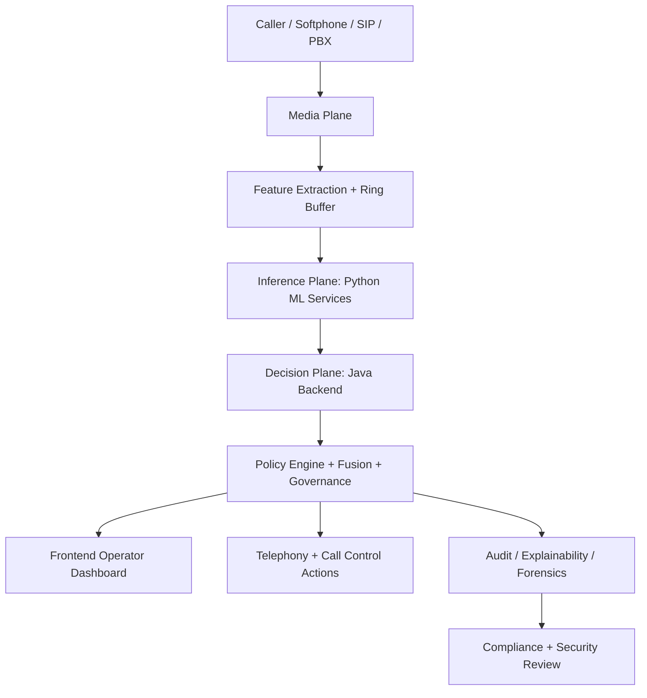
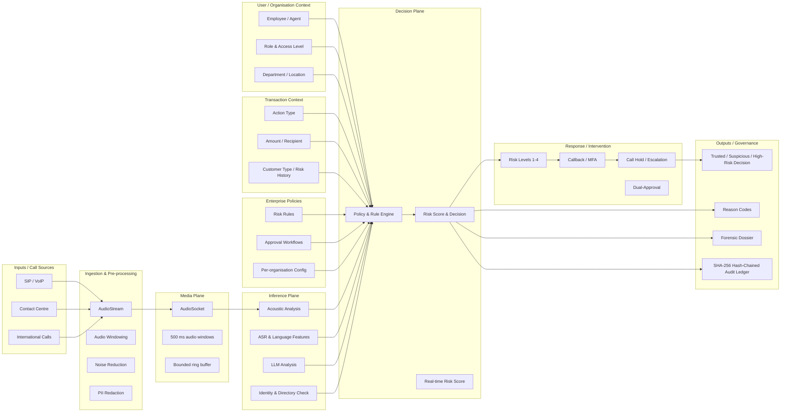
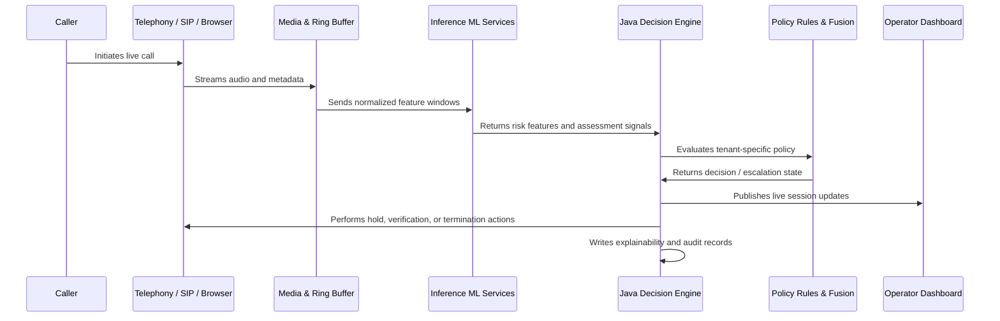
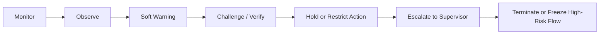

# SentinelVoice

## SIH Problem Statement: Real-Time Voice Cloning & Synthetic Speech Defense

SentinelVoice is an enterprise-grade, real-time fraud interception platform designed to detect and prevent voice-based impersonation, synthetic speech attacks, and socially engineered financial fraud during active calls. The system continuously evaluates live voice interactions using multi-source evidence such as acoustic authenticity, caller context, relationship trust, policy constraints, and transaction intent. It is engineered not merely to classify a voice as synthetic, but to determine whether a live call is likely to lead to unauthorized or malicious action and to intervene before harm occurs.

This repository implements a full-stack proof-of-concept and platform prototype for the problem domain addressed in SIH_104. The system spans the media ingestion layer, ML inference layer, Java decision engine, and operator-facing frontend, with support for telephony, call monitoring, policy reasoning, and governance workflows.

---

## 1. Problem Definition

Modern fraud actors increasingly exploit generative AI to clone voices, mimic trusted executives, and socially engineer employees or customers into taking an irreversible action such as a money transfer, account reset, confidential disclosure, or approval of a sensitive transaction.

Traditional security controls are insufficient because they typically answer only narrow questions such as:

- Is the caller ID valid?
- Is the number registered?
- Is the voice statistically suspicious?

However, fraud prevention in practice requires a more complete question:

> Is this live call, in this specific context, likely to cause harmful action, and can the system intervene before that action is completed?

SentinelVoice addresses this by modeling the issue as a real-time risk and intervention system rather than a static voice-classification problem.

---

## 2. Objective of the Solution

The platform aims to provide a reliable operational layer that:

- detects synthetic or manipulated voice patterns in active conversations
- correlates voice behaviour with transaction and business risk
- evaluates decision-making against tenant-specific policies
- supports human review and escalation workflows
- offers explainability and auditability for compliance or forensic investigation
- prevents harmful actions before the irreversible step is taken

In short, the system attempts to determine not only whether a voice sounds fake, but whether a call is dangerous in context.

---

## 3. Core Design Principles

1. Raw audio is never retained in the Java decision plane.
2. Inference is performed on ephemeral signal windows and derived features.
3. Every decision is anchored to tenant-aware policy evaluation.
4. The platform emphasizes explainability and auditability.
5. Risk decisions are evidence-based rather than single-model guesses.
6. The architecture is designed for real-time operational deployment, not just offline experimentation.

---

## 4. Functional Objectives

The platform is designed to provide the following capabilities:

- detect voice-synthesis and cloning artifacts in real or processed audio streams
- correlate caller behaviour with business context and transaction risk
- evaluate policy rules over active sessions and decision states
- support operator dashboards and case workflows
- provide forensic explainability for high-risk events
- maintain compliance-oriented retention, consent, and audit controls
- support demo, lab, and telephony-driven validation scenarios

---

## 5. System Architecture

The project follows a four-plane architecture designed to separate responsibilities and improve reliability across media, inference, decision, and presentation layers.



### 5.0 Reference Architecture Overview



### 5.1 Media Plane

This layer handles live call audio, telephony interactions, and raw signal capture. It is designed to keep audio ephemeral and minimize persistence.

Responsibilities:
- audio capture and normalization
- console and softphone integration
- SIP / telephony channels
- bounded ring buffer management

### 5.2 Inference Plane

The inference plane is implemented in Python and hosts the ML and feature-extraction logic.

Responsibilities:
- voice feature extraction
- speaker embedding and authenticity scoring
- intent and prosody analysis
- streaming analysis for continuous risk evaluation
- LLM gateway integration where contextual reasoning is required

### 5.3 Decision Plane

The decision plane is implemented using Java and Spring Boot. It acts as the control and policy engine of the platform.

Responsibilities:
- authentication and tenant controls
- role-based access and authorization
- policy rule evaluation
- fusion and risk calculation
- call lifecycle and telephony decision making
- audit logging and session forensics

### 5.4 Presentation Plane

The presentation plane is a React-based dashboard used by analysts and administrators.

Responsibilities:
- live calls dashboard
- approval and review interface
- policy and compliance management screens
- directory and telephony settings
- lab and demo simulation interface

---

## 6. High-Level Runtime Workflow



This flow represents the project’s core philosophy: continuous evidence gathering followed by controlled action based on policy and governance, rather than isolated model output.

---

## 7. Risk Response Model

The system does not rely on a single decision threshold. Instead, it uses a graduated response ladder that scales intervention based on evidence strength and business impact.



This staged response enables practical enterprise deployment while minimizing unnecessary disruption for normal interactions.

---

## 8. Project Modules

### Backend

Location: `backend/`

The Java backend is the principal decision and orchestration layer.

Key capabilities include:
- Spring Boot service layer
- authentication and tenant management
- policy compilation and rule evaluation
- fusion and risk-scoring logic
- telephony state and call lifecycle handling
- audit logging and session forensics

### Frontend

Location: `frontend/`

The frontend is built with React + Vite and provides the operator control surfaces.

It includes dashboards for:
- live calls
- approvals and review
- compliance and policy pages
- directory and telephony settings
- risk tuning and scenario management

### ML Engine

Location: `ml-engine/`

The ML engine contains the audio-analysis and inference services. It is designed around fast feature extraction and lightweight scoring loops suitable for near real-time operation.

### Gateway

Location: `gateway/`

The gateway layer handles protocol adaptation, Asterisk interaction, and telecom bridging where live signaling or media endpoints need to interact with the decision plane.

### Infrastructure

Location: `infra/`, `docker-compose.yml`, `Makefile`, `scripts/`

This infrastructure layer enables:
- local orchestration
- Dockerized setup
- PostgreSQL and Supabase integration
- environment and demo automation
- validation and deployment scripts

---

## 9. Technology Stack

### Decision and Core Services
- Java 17+
- Spring Boot
- PostgreSQL
- Flyway
- Spring Security
- WebSockets / STOMP

### Frontend
- React
- Vite
- Tailwind CSS
- React Router

### ML and Inference
- Python
- FastAPI and async service layer
- ML feature pipelines
- LLM gateway abstraction
- model evaluation and benchmarking tools

### Telephony and Runtime Integration
- Asterisk
- SIP / PJSIP integrations
- live call orchestration
- telephony route and status tracking

### DevOps and Deployment
- Docker
- Docker Compose
- Makefile-driven task orchestration
- local and cloud deployment scripts

---

## 10. Why This Project Matters

The system is designed to protect high-value decision points where a single fraudulent call can trigger financial or institutional harm. It addresses the gap between voice authenticity detection and practical enterprise security by combining:

- signal evidence
- context evidence
- policy evidence
- governance evidence

This is more reliable than a single-model verdict, especially under adversarial conditions where attackers intentionally manipulate audio, spoof numbers, or exploit urgency and authority cues.

---

## 11. Security and Trust Model

SentinelVoice is built around the principle that fraud-intervention systems must be explainable, auditable, and policy-aware.

The repository includes design features to support that goal:

- tenant-aware access control
- risk and policy review workflows
- audit logs for decision traces
- explanation and dossier creation for sessions
- secure handling of policies, consent, and compliance metadata

The platform explicitly avoids treating model output as the sole source of truth. Instead, policy validation, operator review, and structured auditing remain part of the decision loop.

---

## 12. Repository Structure

```text
.
├── backend/               # Java service layer and business logic
├── frontend/              # React + Vite presentation layer
├── gateway/               # media/protocol integration and telecom bridging
├── ml-engine/             # inference and model-based analysis
├── infra/                 # infrastructure and database assets
├── docs/                  # architecture, plan, evaluation, contracts
├── scripts/               # automation and validation scripts
├── docker-compose.yml     # service orchestration
├── Makefile               # project task runner
├── README.md              # project overview and onboarding guide
├── .env.example           # environment sample
├── .gitignore             # repository ignore rules
├── LICENSE                # project license
└── ...
```

---

## 13. Getting Started

### Prerequisites

- Java 17+
- Maven
- Node.js and npm
- Python 3.10+
- Docker and Docker Compose
- Git

### 1. Clone the repository

```bash
git clone <repository-url>
cd Sih_104
```

### 2. View available project commands

```bash
make help
```

For Windows users:

```powershell
.\make.cmd help
```

### 3. Start the platform

Recommended local flow:

```bash
make dev
```

This is the orchestration path for bringing up the platform layers in a consistent local environment.

### 4. Run individual components

```bash
make backend
make frontend
make ml
make asterisk
```

You may also run each component directly from its folder using the project’s native commands and scripts.

---

## 14. Typical Use Cases

- fraud monitoring for banking and financial institutions
- executive impersonation protection during live calls
- insurance or government call-center fraud defense
- live verification during high-risk transaction approvals
- red-team demo and adversarial voice-scenario testing
- compliance-oriented incident investigation and audit review

---

## 15. Evaluation and Validation

The project includes evaluation artifacts and benchmarking logic to test signal quality, robustness, and operational readiness.

Validation work includes:
- model evaluation under synthetic and degraded conditions
- telephony and call-flow testing
- policy simulation and rule review
- UI and operator workflow validation
- demo lab scenario execution

---

## 16. Limitations and Realism

A responsible project of this nature must acknowledge constraints.

- No single acoustic detector is sufficient for critical trust decisions
- Real-world telephony channel quality varies significantly
- Attackers adapt quickly to model weaknesses
- High-risk decisions require human oversight and policy interpretation

Therefore, SentinelVoice is intentionally designed as a layered, explainable, and policy-aware system rather than a simple binary classifier.

---

## 17. Future Scope

This project is extensible toward:
- broader enterprise deployment
- additional telecom integrations
- multi-tenant policy customization
- cloud-hosted inference and orchestration
- stronger compliance and retention workflows
- enterprise-grade monitoring and observability

---

## 18. Conclusion

SentinelVoice represents a practical and formal response to the growing risk of AI-driven voice fraud. It combines live-call analysis, multi-source evidence fusion, policy-aware decision making, and operator action into a single system that is useful in real operational scenarios, not just in a research notebook.

The project is structured to reflect the needs of a serious SIH challenge: a complete end-to-end architecture, reasoning under uncertainty, explainability, risk control, and a clear path from signal capture to secure intervention.

---

## 19. Additional Documentation

This repository contains additional detailed project references in the following areas:

- `docs/00_PROJECT_CONTEXT.md` — project problem framing and architecture context
- `docs/01_EXECUTION_PLAN.md` — execution strategy and build sequencing
- `docs/v2/CHANGELOG.md` — project evolution and milestone notes
- `docs/contracts/` — versioned interface contracts
- `scripts/` — validation and environment setup tools

For operational and technical detail, consult the project documentation alongside this README.
