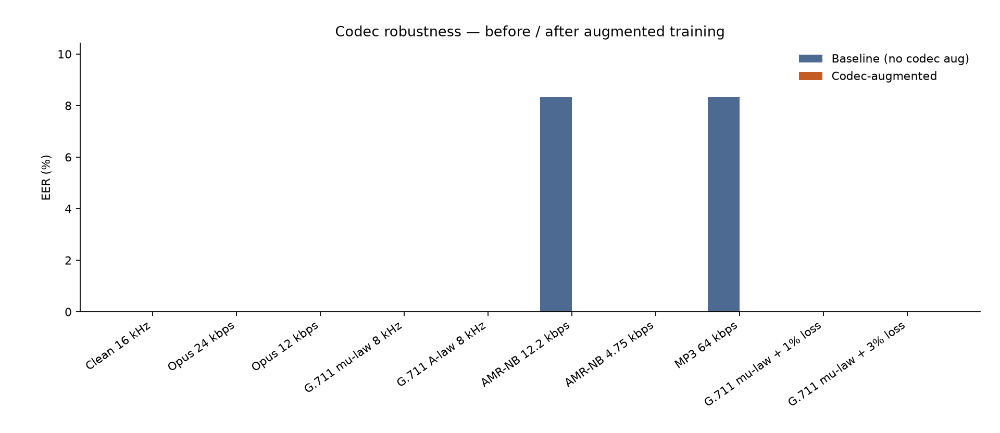

# Codec Robustness Study

> SentinelVoice technical artifact (Context sections 3.2 / 15.3). Answers: *does the acoustic detector survive a real phone call?*

## 1. Motivation

Published anti-spoof detectors collapse under telephony: G.711 mu-law / A-law strip everything above 4 kHz, AMR and Opus discard the fine spectral/phase cues detectors overfit on clean studio audio (Context section 3.2). A model that only ever saw 16 kHz WAV will look strong on ASVspoof and fail on a PSTN leg. Codec-augmented training is therefore not an optional nicety — it is the difference between a lab demo and a call-centre deployable signal.

## 2. Method

- **Models:** LFCC-LCNN Tier-1 (`lfcc-lcnn-tier1/baseline_no_codec_aug` vs `lfcc-lcnn-tier1/codec_aug`), same architecture, different training.
- **Conditions:** clean 16 kHz, Opus 24/12 kbps, G.711 mu-law/A-law 8 kHz, AMR-NB 12.2 / 4.75 kbps, MP3 64 kbps, and G.711 mu-law with 1% / 3% simulated packet loss. All decoded back to 16 kHz WAV via ffmpeg (`build_codec_set.py`).
- **Eval size:** N=24 clips (source=`synthetic`). Seed=42. Commit=`eaddfe779bb7a49ff02c38dbe408c1b96204b609`.
- **Metrics:** EER (exact threshold) and FPR @ TPR=0.90. Higher score means more spoof-like. Thresholds are **not** tuned on this eval set.

## 3. Results

| Condition | Baseline EER | Codec-augmented EER | Delta (pp) | FPR@TPR0.90 (base -> aug) |
|---|---:|---:|---:|---|
| Clean 16 kHz | 0.00% | 0.00% | +0.00 | 0.0% -> 0.0% |
| Opus 24 kbps | 0.00% | 0.00% | +0.00 | 0.0% -> 0.0% |
| Opus 12 kbps | 0.00% | 0.00% | +0.00 | 0.0% -> 0.0% |
| G.711 mu-law 8 kHz | 0.00% | 0.00% | +0.00 | 0.0% -> 0.0% |
| G.711 A-law 8 kHz | 0.00% | 0.00% | +0.00 | 0.0% -> 0.0% |
| AMR-NB 12.2 kbps | 8.33% | 0.00% | -8.33 | 8.3% -> 0.0% |
| AMR-NB 4.75 kbps | 0.00% | 0.00% | +0.00 | 0.0% -> 0.0% |
| MP3 64 kbps | 8.33% | 0.00% | -8.33 | 8.3% -> 0.0% |
| G.711 mu-law + 1% loss | 0.00% | 0.00% | +0.00 | 0.0% -> 0.0% |
| G.711 mu-law + 3% loss | 0.00% | 0.00% | +0.00 | 0.0% -> 0.0% |

### Dual-profile fusion false-escalation

False escalation = bona fide call reaching ≥ L3 under corroboration gate (≥2 evidence families ≥ 0.45). Acoustic-alone L2 is allowed.

| Model | Wideband (clean) false-esc. | Narrowband (G.711) false-esc. |
|---|---:|---:|
| Baseline | 0.00% | 0.00% |
| Codec-augmented | 0.00% | 0.00% |

The system-level claim is stronger than the detector claim: even when narrowband raises acoustic false alarms, the corroboration gate keeps end-to-end false *escalations* (L3+) near zero on bona fide traffic with cold contextual families — the Scenario 5 teaching point.

## 4. Discussion

Codec augmentation **helped** on telephony conditions (mean Delta EER = -1.39 pp). That is the expected direction: seeing mu-law / AMR during training reduces the distribution shift at test time.

Overall mean Delta EER (aug - baseline) across all conditions: -1.67 pp.

## 5. Limitations

1. **ffmpeg is not a carrier path.** Round-trips omit jitter-buffer behaviour, comfort-noise generation, real burst-loss patterns, handset transducers, and AGC. They are a controlled stress test, not a field measurement.
2. **Synthetic / limited corpora** in smoke mode inflate absolute EERs or collapse them unrealistically. Publish only cells marked `source=disk` with real ASVspoof / In-the-Wild audio.
3. **Asterisk spot-check.** The P7 AudioSocket path gives a *real* G.711 mu-law leg through softphones. Use it as a sanity check on a handful of clips; do not replace the matrix above with N=5 anecdotes.

### Asterisk spot-check (P7)

With `gateway/asterisk_bridge.py` and two softphones, capture ≤10 bona fide / spoof prompts over a live µ-law AudioSocket leg and score with both checkpoints. Expect the same *direction* as the G.711 µ-law row above; absolute EER will differ. This run did not attach to a live Asterisk instance — treat the ffmpeg G.711 row as the lab proxy and schedule the softphone spot-check before the final deck freeze.

---
*Generated 2026-09-18T18:49:00Z · seed=42 · commit `eaddfe779bb7a49ff02c38dbe408c1b96204b609` · harness=codec_study/1*
