# SentinelVoice — Evaluation Report

> Generated by `ml-engine/benchmarks/run_eval.py` (Context §15).
> **Be honest:** In-the-Wild EER is expected to be far worse than in-domain (§3.1).
> Acoustic evidence is only ~24% of fusion weight; architecture is designed around that fact.

## Reproducibility

| Field | Value |
|---|---|
| Generated (UTC) | 2026-09-18T18:33:34Z |
| Git commit | `91dafd902acbfe1630f620db69a23243bd9a4826` |
| Random seed | `42` |
| Harness version | `1` |
| Synthetic smoke | `True` |
| Limit | `40` |

### Model checkpoints

| Model ID | Checkpoint | Calibration |
|---|---|---|
| `lfcc-lcnn-tier1/baseline_no_codec_aug` | `ml-engine\models\antispoof\baseline_no_codec_aug.pt` | `sigmoid-fallback` |
| `lfcc-lcnn-tier1/codec_aug` | `ml-engine\models\antispoof\codec_aug.pt` | `sigmoid-fallback` |

### Dataset versions

| Dataset | Version | Source | N (primary) | Note |
|---|---|---|---|---|
| `asvspoof2019_la_eval` | `synthetic@asvspoof2019_la_eval` | synthetic | 40 | SYNTHETIC SMOKE CORPUS — not a published result. Context §3.1: report real In-the-Wild / ASVspoof numbers when corpora are present. |
| `asvspoof2021_df_eval` | `synthetic@asvspoof2021_df_eval` | synthetic | 40 | SYNTHETIC SMOKE CORPUS — not a published result. Context §3.1: report real In-the-Wild / ASVspoof numbers when corpora are present. |
| `in_the_wild` | `synthetic@in_the_wild` | synthetic | 40 | SYNTHETIC SMOKE CORPUS — not a published result. Context §3.1: report real In-the-Wild / ASVspoof numbers when corpora are present. |
| `codec_degraded` | `synthetic@codec_degraded` | synthetic | 40 | SYNTHETIC SMOKE CORPUS — not a published result. Context §3.1: report real In-the-Wild / ASVspoof numbers when corpora are present. |

## Codec-degradation study (§15.3)

Before/after codec-augmented training. Empty cells mean that checkpoint was not evaluated.

| Condition | EER (baseline) | EER (codec-augmented) | min t-DCF (baseline) | min t-DCF (codec-aug) |
|---|---|---|---|---|
| Clean 16 kHz | 0.00% | 10.00% | 0.0000 | 0.4500 |
| Opus 24 kbps | 0.00% | 10.00% | 0.0000 | 0.5000 |
| G.711 µ-law 8 kHz | 15.00% | 25.00% | 0.9000 | 0.9000 |
| AMR-NB 12.2 kbps | 15.00% | 25.00% | 0.9000 | 0.9000 |
| In-the-Wild | 15.00% | 20.00% | 0.8500 | 0.9000 |

## Full detection metrics (every dataset × channel × model)

Scores: higher ⇒ more spoof-like. min t-DCF uses ASVspoof 2019 CM costs (Todisco et al., Interspeech 2019; C_miss=1, C_fa=10, π_spoof=0.05).

| Model | Dataset | Channel | N | EER | EER θ | min t-DCF | AUC | FPR@TPR0.90 | ECE | Source |
|---|---|---|---|---|---|---|---|---|---|---|
| `lfcc-lcnn-tier1/baseline_no_codec_aug` | `asvspoof2019_la_eval` | `clean_16k` | 40 | 0.00% | -0.3764 | 0.0000 | 1.0000 | 0.00% | 0.4626 | synthetic |
| `lfcc-lcnn-tier1/baseline_no_codec_aug` | `asvspoof2019_la_eval` | `opus_24k` | 40 | 0.00% | -0.3262 | 0.0000 | 1.0000 | 0.00% | 0.4204 | synthetic |
| `lfcc-lcnn-tier1/baseline_no_codec_aug` | `asvspoof2019_la_eval` | `g711_ulaw_8k` | 40 | 15.00% | -0.3273 | 0.9000 | 0.8850 | 15.00% | 0.0829 | synthetic |
| `lfcc-lcnn-tier1/baseline_no_codec_aug` | `asvspoof2019_la_eval` | `amr_nb_12k2` | 40 | 15.00% | -0.3273 | 0.9000 | 0.8850 | 15.00% | 0.0829 | synthetic |
| `lfcc-lcnn-tier1/baseline_no_codec_aug` | `asvspoof2021_df_eval` | `clean_16k` | 40 | 0.00% | -0.3764 | 0.0000 | 1.0000 | 0.00% | 0.4626 | synthetic |
| `lfcc-lcnn-tier1/baseline_no_codec_aug` | `asvspoof2021_df_eval` | `opus_24k` | 40 | 0.00% | -0.3262 | 0.0000 | 1.0000 | 0.00% | 0.4204 | synthetic |
| `lfcc-lcnn-tier1/baseline_no_codec_aug` | `asvspoof2021_df_eval` | `g711_ulaw_8k` | 40 | 15.00% | -0.3273 | 0.9000 | 0.8850 | 15.00% | 0.0829 | synthetic |
| `lfcc-lcnn-tier1/baseline_no_codec_aug` | `asvspoof2021_df_eval` | `amr_nb_12k2` | 40 | 15.00% | -0.3273 | 0.9000 | 0.8850 | 15.00% | 0.0829 | synthetic |
| `lfcc-lcnn-tier1/baseline_no_codec_aug` | `in_the_wild` | `clean_16k` | 40 | 15.00% | -0.3136 | 0.8500 | 0.9150 | 20.00% | 0.0796 | synthetic |
| `lfcc-lcnn-tier1/baseline_no_codec_aug` | `in_the_wild` | `opus_24k` | 40 | 10.00% | -0.2654 | 0.1500 | 0.9850 | 10.00% | 0.0682 | synthetic |
| `lfcc-lcnn-tier1/baseline_no_codec_aug` | `in_the_wild` | `g711_ulaw_8k` | 40 | 5.00% | -0.2770 | 0.5500 | 0.9725 | 5.00% | 0.0713 | synthetic |
| `lfcc-lcnn-tier1/baseline_no_codec_aug` | `in_the_wild` | `amr_nb_12k2` | 40 | 5.00% | -0.2770 | 0.5500 | 0.9725 | 5.00% | 0.0713 | synthetic |
| `lfcc-lcnn-tier1/baseline_no_codec_aug` | `codec_degraded` | `opus_24k` | 40 | 0.00% | -0.3262 | 0.0000 | 1.0000 | 0.00% | 0.4204 | synthetic |
| `lfcc-lcnn-tier1/baseline_no_codec_aug` | `codec_degraded` | `g711_ulaw_8k` | 40 | 15.00% | -0.3273 | 0.9000 | 0.8850 | 15.00% | 0.0829 | synthetic |
| `lfcc-lcnn-tier1/baseline_no_codec_aug` | `codec_degraded` | `amr_nb_12k2` | 40 | 15.00% | -0.3273 | 0.9000 | 0.8850 | 15.00% | 0.0829 | synthetic |
| `lfcc-lcnn-tier1/codec_aug` | `asvspoof2019_la_eval` | `clean_16k` | 40 | 10.00% | -0.4046 | 0.4500 | 0.9725 | 5.00% | 0.3839 | synthetic |
| `lfcc-lcnn-tier1/codec_aug` | `asvspoof2019_la_eval` | `opus_24k` | 40 | 10.00% | -0.3682 | 0.5000 | 0.9700 | 5.00% | 0.4233 | synthetic |
| `lfcc-lcnn-tier1/codec_aug` | `asvspoof2019_la_eval` | `g711_ulaw_8k` | 40 | 25.00% | -0.3557 | 0.9000 | 0.8225 | 25.00% | 0.1479 | synthetic |
| `lfcc-lcnn-tier1/codec_aug` | `asvspoof2019_la_eval` | `amr_nb_12k2` | 40 | 25.00% | -0.3557 | 0.9000 | 0.8225 | 25.00% | 0.1479 | synthetic |
| `lfcc-lcnn-tier1/codec_aug` | `asvspoof2021_df_eval` | `clean_16k` | 40 | 10.00% | -0.4046 | 0.4500 | 0.9725 | 5.00% | 0.3839 | synthetic |
| `lfcc-lcnn-tier1/codec_aug` | `asvspoof2021_df_eval` | `opus_24k` | 40 | 10.00% | -0.3682 | 0.5000 | 0.9700 | 5.00% | 0.4233 | synthetic |
| `lfcc-lcnn-tier1/codec_aug` | `asvspoof2021_df_eval` | `g711_ulaw_8k` | 40 | 25.00% | -0.3557 | 0.9000 | 0.8225 | 25.00% | 0.1479 | synthetic |
| `lfcc-lcnn-tier1/codec_aug` | `asvspoof2021_df_eval` | `amr_nb_12k2` | 40 | 25.00% | -0.3557 | 0.9000 | 0.8225 | 25.00% | 0.1479 | synthetic |
| `lfcc-lcnn-tier1/codec_aug` | `in_the_wild` | `clean_16k` | 40 | 20.00% | -0.3441 | 0.9000 | 0.8400 | 20.00% | 0.1249 | synthetic |
| `lfcc-lcnn-tier1/codec_aug` | `in_the_wild` | `opus_24k` | 40 | 20.00% | -0.3015 | 0.8000 | 0.8950 | 20.00% | 0.0763 | synthetic |
| `lfcc-lcnn-tier1/codec_aug` | `in_the_wild` | `g711_ulaw_8k` | 40 | 20.00% | -0.2977 | 0.9000 | 0.8625 | 25.00% | 0.0747 | synthetic |
| `lfcc-lcnn-tier1/codec_aug` | `in_the_wild` | `amr_nb_12k2` | 40 | 20.00% | -0.2977 | 0.9000 | 0.8625 | 25.00% | 0.0747 | synthetic |
| `lfcc-lcnn-tier1/codec_aug` | `codec_degraded` | `opus_24k` | 40 | 10.00% | -0.3682 | 0.5000 | 0.9700 | 5.00% | 0.4233 | synthetic |
| `lfcc-lcnn-tier1/codec_aug` | `codec_degraded` | `g711_ulaw_8k` | 40 | 25.00% | -0.3557 | 0.9000 | 0.8225 | 25.00% | 0.1479 | synthetic |
| `lfcc-lcnn-tier1/codec_aug` | `codec_degraded` | `amr_nb_12k2` | 40 | 25.00% | -0.3557 | 0.9000 | 0.8225 | 25.00% | 0.1479 | synthetic |

## Fairness — false positive rate by group (§13.5)

Metric: **FPR parity** at the model's EER threshold on the fairness probe set. A false positive means a legitimate customer is escalated.

| Group | N bona | FPR | Notes |
|---|---|---|---|
| `age_senior` | 45 | 44.44% | proxy group assignment when Common Voice metadata absent |
| `age_young` | 45 | 55.56% | proxy group assignment when Common Voice metadata absent |
| `dravidian` | 60 | 18.33% | proxy group assignment when Common Voice metadata absent |
| `gender_f` | 45 | 13.33% | proxy group assignment when Common Voice metadata absent |
| `gender_m` | 45 | 24.44% | proxy group assignment when Common Voice metadata absent |
| `indo_aryan` | 60 | 30.00% | proxy group assignment when Common Voice metadata absent |

> Groups are assigned from speaker-id heuristics or a deterministic rotation when Common Voice language labels are absent. Replace with CV language tags for the compliance slide (§13.5).

## Latency (ms)

Measured on the same host as the eval run. Fast path = antispoof window; slow path = ASR-sized stub when Whisper is unavailable; end-to-end = fast+slow.

| Path | p50 | p95 | p99 | mean | n |
|---|---|---|---|---|---|
| fast_path | 5.03 | 6.05 | 6.55 | 5.02 | 20 |
| slow_path | 4.09 | 4.47 | 4.79 | 4.11 | 20 |
| end_to_end | 9.15 | 10.07 | 10.55 | 9.13 | 20 |

## Reliability diagrams

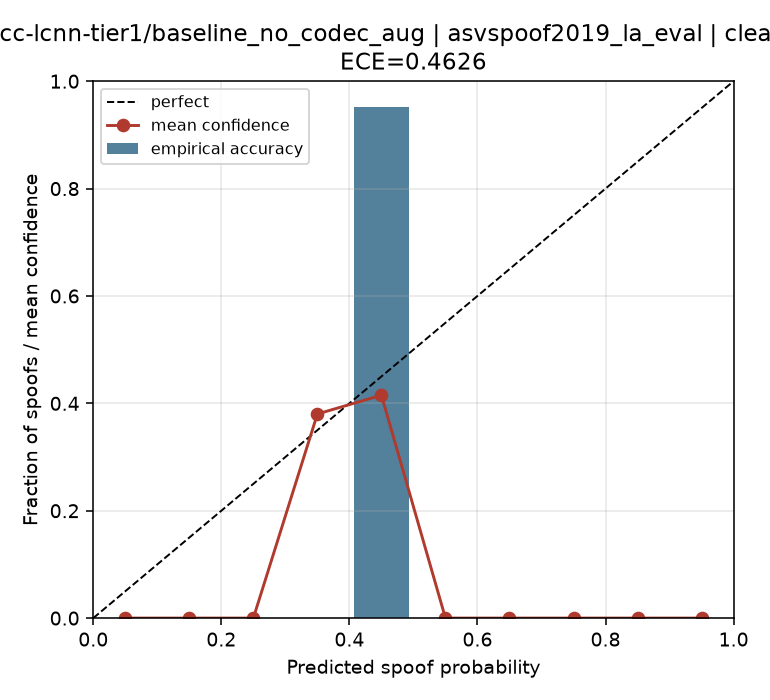

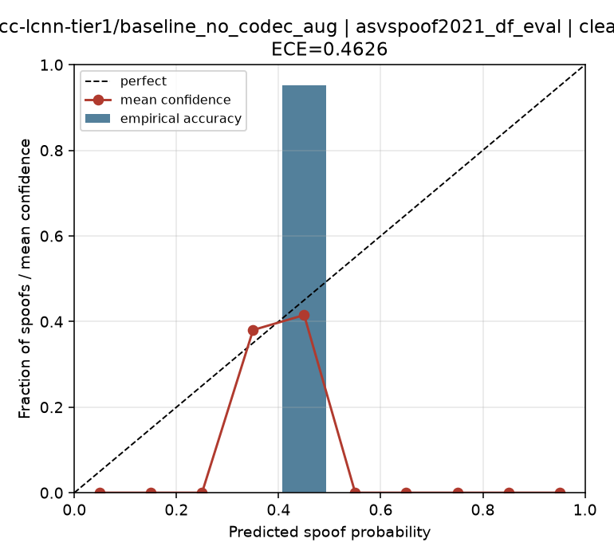

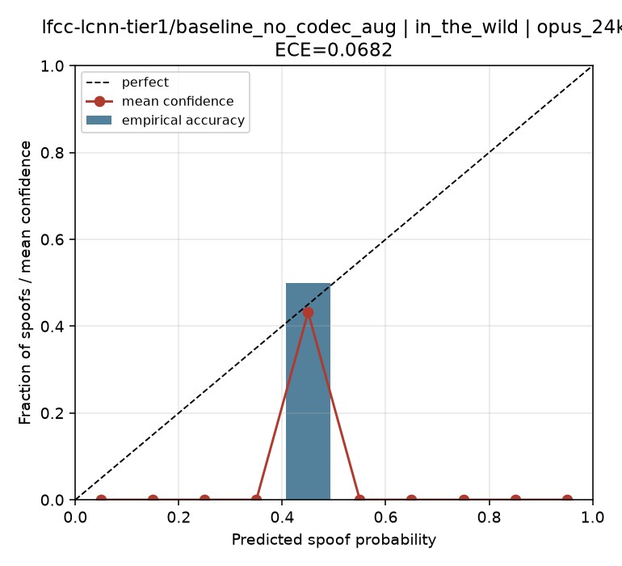

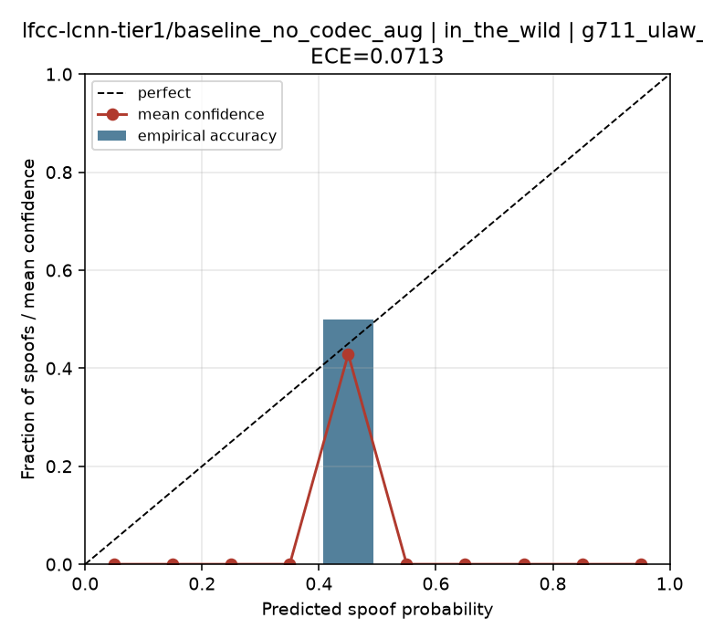

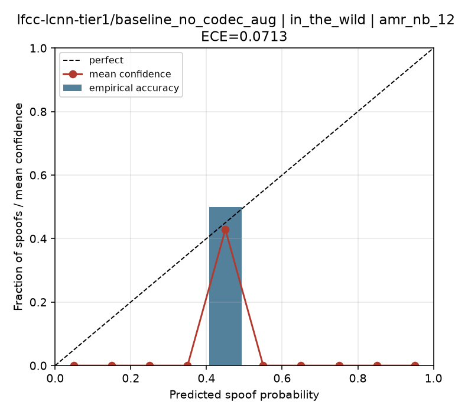

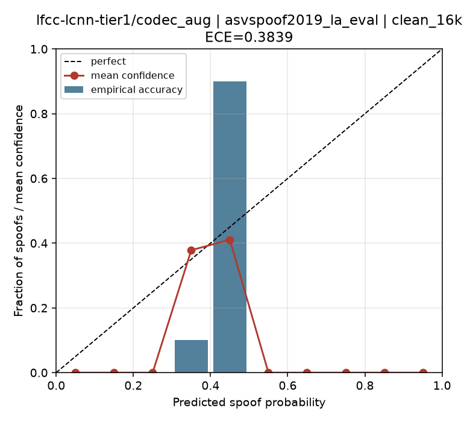

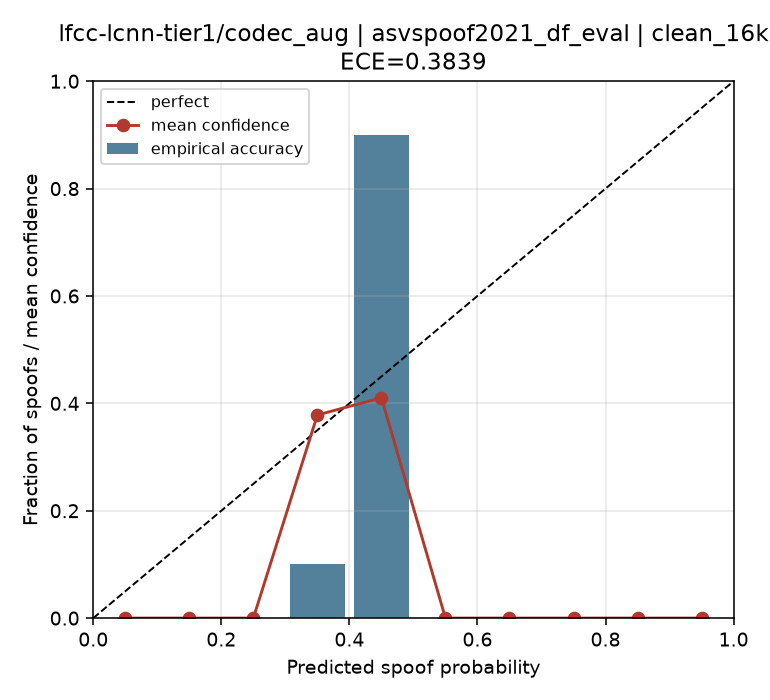

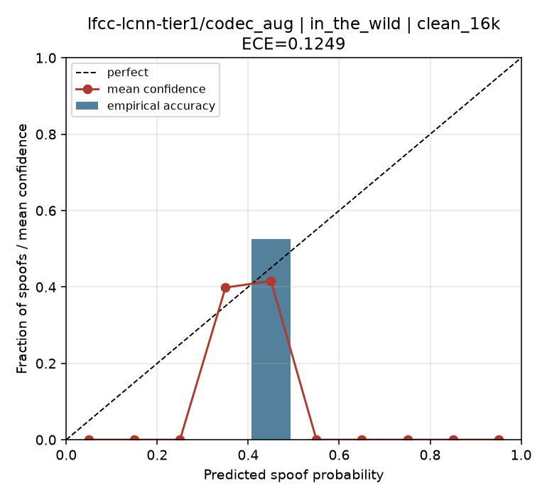

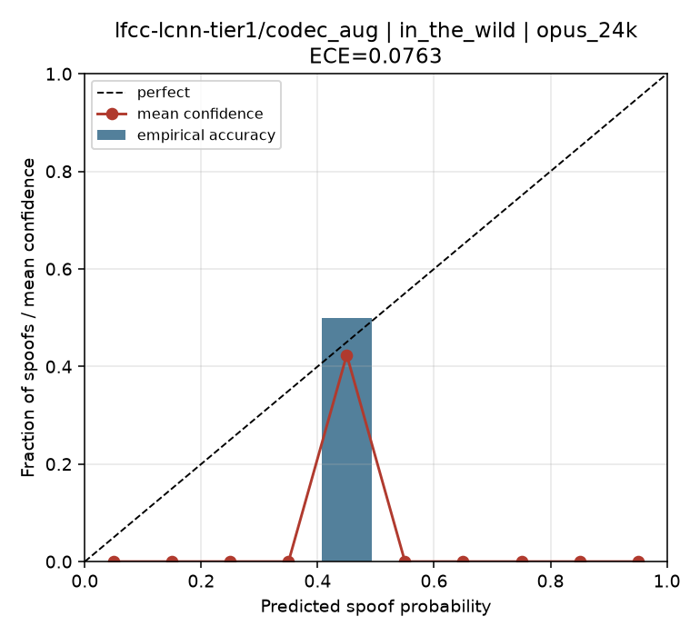

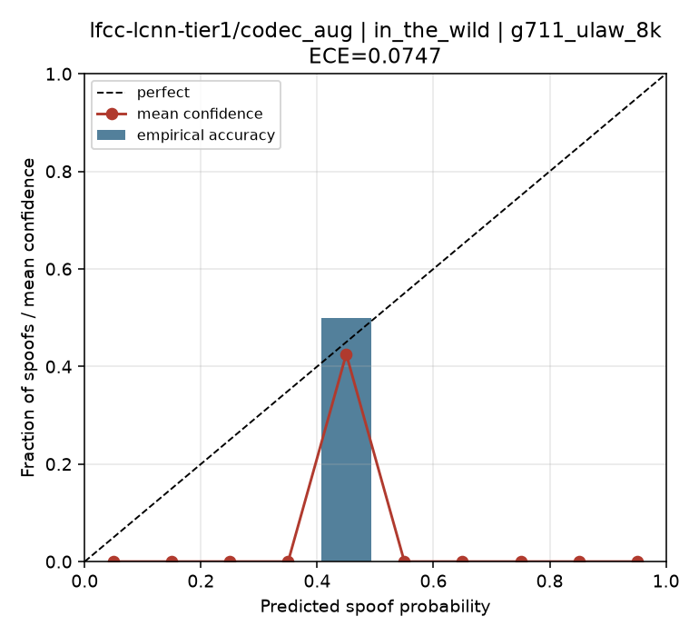

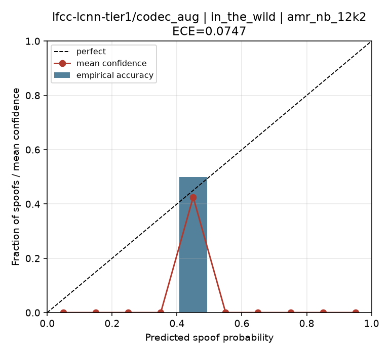

## Honesty notes

- If a cell used a **synthetic** corpus, it is labelled as such and must not be cited as a field result.
- In-the-Wild EER in the mid-20s (%) is consistent with the literature collapse described in §3.1; do not paper over it.
- Do not tune operating thresholds on the evaluation set — report EER / min t-DCF / FPR@TPR.
