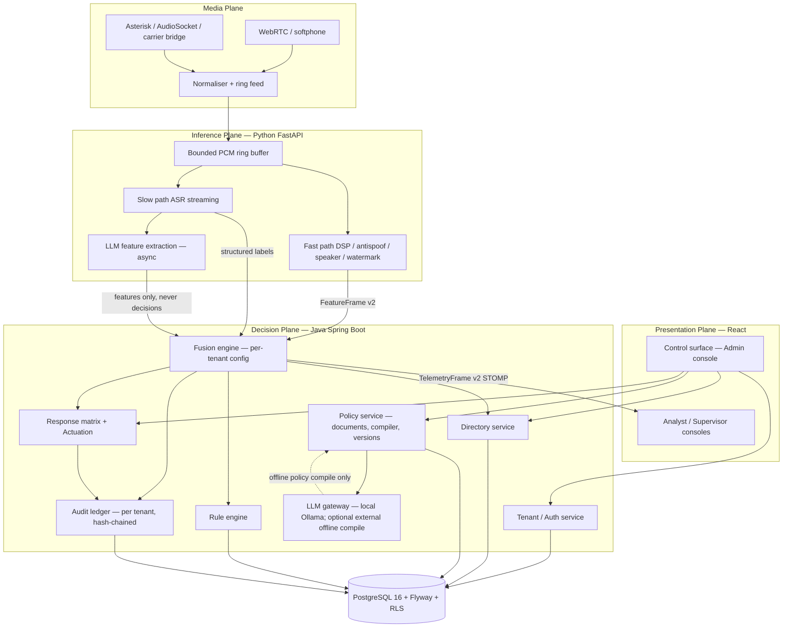
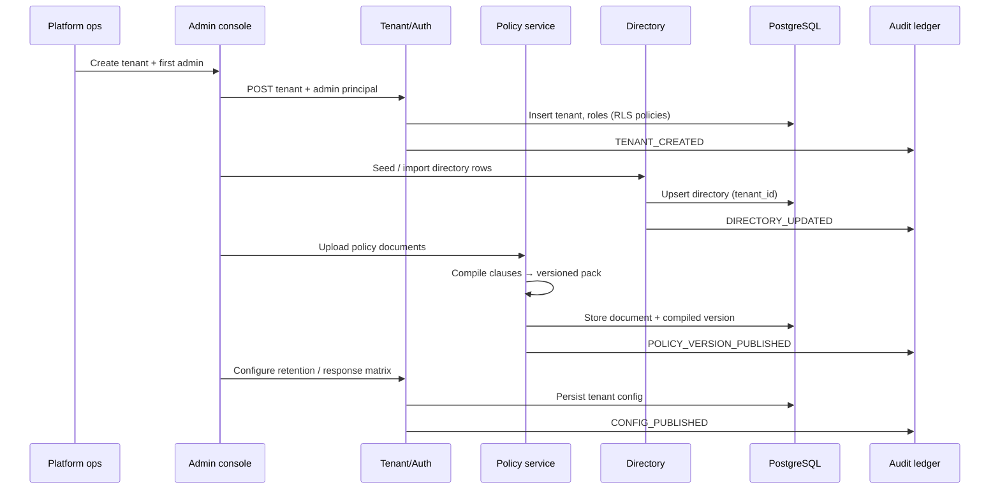
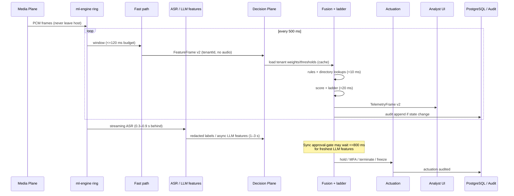

# SentinelVoice V2 — Architecture

Multi-tenant, policy-aware real-time voice-fraud interdiction. This document is the V2
architecture record. Historical v1 context lives under `docs/00_PROJECT_CONTEXT.md` and is
**not** authoritative where it conflicts with this file or P-GLOBAL.

## Planes and components

## Sequence — (a) tenant onboarding

## Sequence — (b) live call from ring to actuation

## Latency budget

| Stage | Budget | Notes |
|-------|--------|--------|
| Fast path (per 500 ms window) | ≤ 120 ms | DSP, antispoof, speaker, watermark attribution |
| Rule / directory lookup | < 10 ms | Tenant-cached config; DB miss is a degradation event |
| Fusion + intervention ladder | < 20 ms | Deterministic; no LLM in this path |
| ASR streaming lag | 0.3–0.9 s behind speech | Labels only; no verbatim persistence |
| LLM feature extraction | 1–3 s async | Never blocks the fast path |
| Sync approval-gate wait | ≤ 800 ms | May wait for freshest LLM features before irreversible action |

## Trust boundaries

| Zone | What lives here | May leave? |
|------|-----------------|------------|
| Media + ml-engine ring | Raw PCM (≤8 s, overwritten) | **Never** — not to Java, DB, disk, logs, or LLM |
| Inference → Decision wire | FeatureFrame numbers, enums, redacted structured labels | Yes — no audio, no full transcript |
| Decision Plane memory | Session state, tenant config cache, risk / level | Tenant-scoped; audited on change |
| PostgreSQL | Tenant config, directory, policy versions, audit chain, redacted derived labels | RLS + `tenant_id`; no PCM, no full transcripts |
| LLM gateway | Redacted text / clause text for **feature extraction** or offline **policy compile** | Prompt-injection hardened; outputs are features only — never scores/levels/actions |
| Presentation | Telemetry + admin APIs | AuthZ by role / `permissions[]`; JWT httpOnly cookies (F2); no raw audio |

**What may cross to the LLM:** redacted ASR snippets or structured clause text under tenant policy compile / feature prompts. **Never:** raw audio, full unredacted call transcripts, other tenants' data, or authority to set risk/level/action.

## Threat model (V2-specific)

| Risk | Mitigation (design) |
|------|---------------------|
| Prompt injection via caller speech | ASR → redaction → allowlisted feature schema; LLM outputs validated against typed feature DTOs; fusion ignores free-text; LLM cannot set score/level/action |
| Prompt injection via uploaded policy documents | Policy compile in isolated job; strip active content; compiled clauses are structured IDs/predicates reviewed before publish; publish requires admin role + audit |
| Malicious / compromised tenant admin weakens thresholds | Versioned config; dual-control / approval for high-impact publishes (later features); every change on hash-chained audit ledger; platform-level floors optional |
| Cross-tenant data leakage | `tenant_id` on every row; PostgreSQL RLS; no shared caches without tenant key; contracts require `tenantId` |
| Replay of admin actions | Nonce / request id + audited mutations; httpOnly session cookies (preferred); short-lived tokens if used; CSRF protection on cookie sessions |

## Related docs

- Feature notes: [`docs/v2/features/`](features/)
- Changelog / deviations: [`CHANGELOG.md`](CHANGELOG.md)
- Contracts: [`docs/contracts/v2/`](../contracts/v2/)
